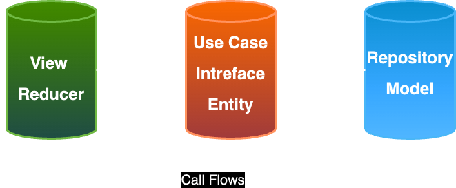

# Package `Search` - `Clean Architecture` with `Composable` and `SwiftUI`

Clean architecture principle emphasizes the sepration of concertns between different layers to create an application structure that is isolated, testable and easy to maintain.

## Layers
The Clean Architecture divides a project into 3 layers:

1. `Domain Layer` - (Business logic) is the inner-most part of the onion (without dependencies to other layers, it is totally isolated). It contains `Entities(Business Models)`, `Use Cases`, and `Repository Interfaces`. This layer could be potentially reused within different projects. Such separation allows for not using the host app within the test target because no dependencies (also 3rd party) are needed — this makes the Domain Use Cases tests take just a few seconds. Note: Domain Layer should not include anything from other layers(e.g Presentation — UIKit or SwiftUI or Data Layer — Mapping Codable).
2. `Presentation Layer` - contains UI (UIViewControllers or `SwiftUI` Views). Views are coordinated by `ViewModels` (Presenters) which execute one or many Use Cases. Presentation Layer depends only on the Domain Layer.
3. `Data Layer` - contains `Repository Implementations` and one or many `Data Sources`. Repositories are responsible for coordinating data from different Data Sources. Data Source can be Remote or Local (for example persistent database). Data Layer depends only on the Domain Layer. In this layer, we can also add mapping of Network JSON Data (e.g. Decodable conformance) to Domain Models.

##  iOS Tech stack

| Development Aspect | Tech |
| ------------- |:-------------:|
| Modularity      | `Swift Package Manager`       |
| Multi Threading      |`swift async-await` & `Task`      |
| Design Pattern      | `Composable Architecture & MVVM`  https://github.com/pointfreeco/swift-composable-architecture - `ComposableArchitecture`    |
| Depedency Injection      | `Dependencies` https://github.com/pointfreeco/swift-dependencies - `@Dependency`    |
| Networking      | `URLSession`   |
| Json Mapping | `Decodable` |
| Image Caching | `CachedAsyncImage` https://github.com/lorenzofiamingo/swiftui-cached-async-image  |
| View | `SwiftUI` |
| Tests | `XCTest` |

## Overview

In this propject i have used the `Modular`, `Clean Architecture`, with `Composable` design patterns. 

The app supports 

| Device Aspect | Support |
| ------------- |:-------------:|
| iPhone      | `Portrait and Landscape`       |
| iPad      |`All orientation` |
| Light Mode      | `yes`   |
| Dark Mode      | `yes`    |

## Reference

